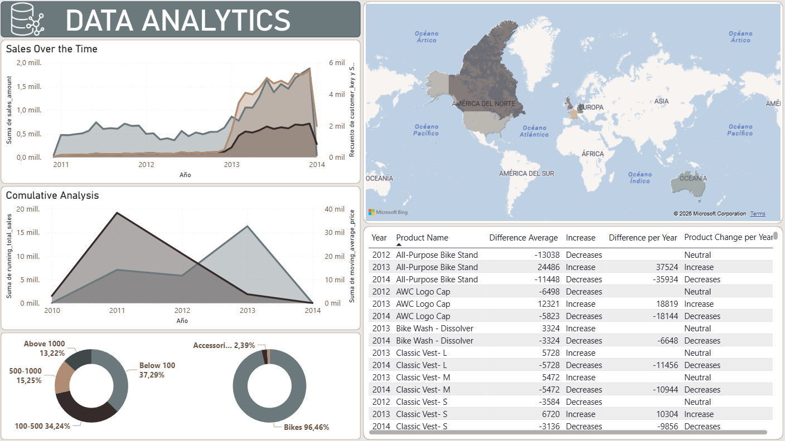

# 📊 Data Analytics Dashboard - Gold Layer Project

[](https://www.microsoft.com/sql-server)
[](https://powerbi.microsoft.com/)
[](https://learn.microsoft.com/en-us/azure/databricks/lakehouse/medallion)


## 📝 Descripción del Proyecto
Este repositorio contiene el desarrollo completo de la **Capa Gold (Capa de Negocio)** de un ecosistema de datos. El objetivo principal fue transformar datos transaccionales crudos en una estructura analítica optimizada para la toma de decisiones, culminando en un dashboard interactivo que visualiza el rendimiento de ventas, comportamiento de productos y segmentación de clientes.

> **Visualiza el resultado final:** > 

---

## 🚀 Características Técnicas (SQL)
El motor de este proyecto reside en la lógica de negocio implementada en SQL Server. Se crearon vistas avanzadas que automatizan métricas clave:

* **Análisis de Desempeño YoY:** Uso de funciones de ventana (`LAG`, `OVER`) para calcular el crecimiento año tras año por producto.
* **Análisis Acumulativo:** Implementación de *Running Totals* y *Moving Averages* para identificar tendencias de ventas a largo plazo.
* **Segmentación de Datos:** Clasificación dinámica de productos por rangos de costo y clientes por geografía.
* **Métricas de Participación:** Cálculos de "Part-to-Whole" para determinar el impacto de cada categoría en el ingreso total.

---

## 📂 Estructura de las Vistas (Capa Gold)
El script principal genera las siguientes tablas lógicas:

| Vista | Propósito Analítico |
| :--- | :--- |
| `gold.cumulative_analysis` | Tendencias históricas y acumulados mensuales. |
| `gold.performance_analysis` | Comparativa de ventas actuales vs promedio y año anterior. |
| `gold.part_to_analysis` | Porcentaje de contribución por categoría de producto. |
| `gold.data_segmentation` | Agrupación de inventario por rangos de costo. |
| `gold.customers_country` | Distribución demográfica de la base de clientes. |

---

## 📈 Insights del Dashboard
Basado en la integración de las vistas SQL con la herramienta de visualización:
1.  **Dominio de Categoría:** Las bicicletas representaron el **96.46%** de las ventas totales, identificándolas como el motor principal del negocio.
2.  **Crecimiento Temporal:** Se observa un pico significativo de ventas y captación de clientes entre 2013 y 2014.
3.  **Eficiencia de Costos:** El **37.29%** de los productos vendidos se encuentran en el rango "Below 100", lo que sugiere un alto volumen de ventas en productos de entrada.
4.  **Distribución Global:** América del Norte se posiciona como el mercado con mayor densidad de clientes.

---

## 🛠️ Instalación y Uso
1. **Clonar el repositorio:**
   ```bash
      git clone https://github.com/leandrogallo-dev/data-analytics-dashboard.git
   ```
   
---

# 📂 Repository Structure

```
sanoyfresco-sales-analytics
│
├── dashboard/ # dashboard from power BI
├── datasets/  # Dataset used for the analysis
├── scripts/   # SQL scripts with analytical queries
│
├── docs/      # Project documentation
│
├── README.md  # Project documentation
└── LICENSE
```

---

## 🛡️ License

This project is licensed under the [MIT License](LICENSE). You are free to use, modify, and share this project with proper attribution.

---

# 👨‍💻 About Me

Hi! I'm **Leandro Gallo**, a **Systems Engineering student** from Argentina with a strong interest in:

- Data Engineering
- Data Analytics
- Backend Development
- Cybersecurity
- Software Development

I enjoy building **data pipelines, automation tools, and data-driven systems**, and I am currently developing projects to strengthen my skills in **data architecture, SQL development, and analytics**.

This repository is part of my **technical portfolio**, where I showcase projects related to:

- Data Warehousing
- ETL Pipelines
- Data Modeling
- Analytics

---

# 🔗 Connect With Me

📧 Email  
leandrogallo698@gmail.com

