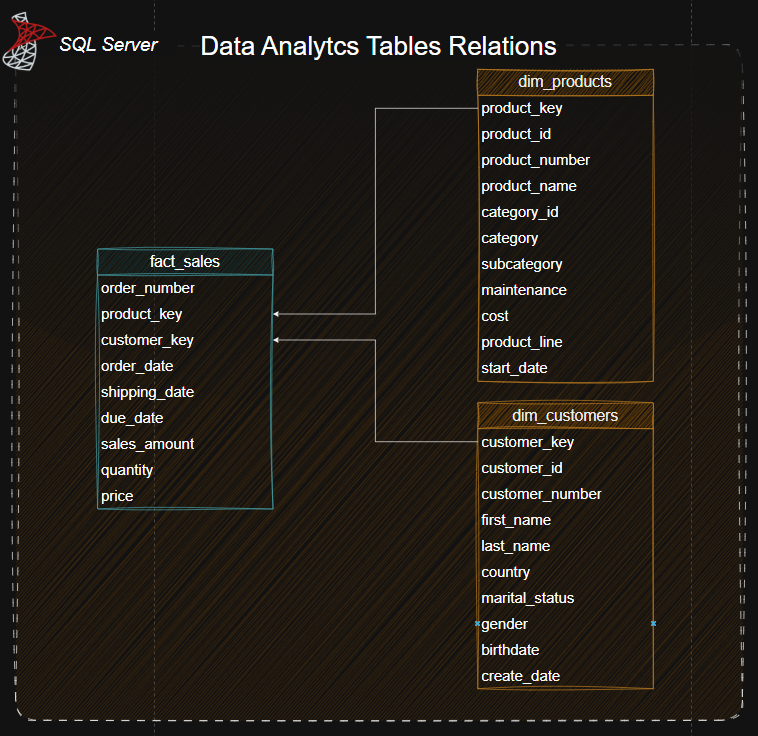

# 📂 Gold Layer: Table & View Documentation

The **Gold Layer** represents the final stage of data transformation. These views are built upon cleaned data to provide high-level business metrics, optimized for visualization tools like Power BI.

---

## 🏗️ View Definitions

> **Table Diagram:** > 

### 1. `gold.cumulative_analysis`
**Purpose:** Analyzes sales momentum over time by aggregating totals at a monthly level.
- **Key Logic:** Uses `DATETRUNC` to standardize dates by month and Window Functions (`OVER`) to calculate running totals.
- **Metrics:**
    - `running_total_sales`: The accumulated sales amount from the start of the dataset to the current month.
    - `moving_average_price`: A smoothed average of product prices to identify pricing trends.

### 2. `gold.performance_analysis`
**Purpose:** Evaluates product success by comparing current performance against historical averages and the previous year.
- **Key Logic:** Employs `AVG() OVER` for baseline comparisons and `LAG()` to retrieve values from the same period in the prior year.
- **Metrics:**
    - `current_average_sales`: The lifetime average sales for a specific product.
    - `diff_avg`: The variance between current sales and the product's average.
    - `py_change`: A categorical label ('Increase', 'Decrease', 'Neutral') based on Year-Over-Year (YoY) performance.

### 3. `gold.part_to_analysis`
**Purpose:** Measures the contribution of each product category to the total revenue.
- **Key Logic:** Calculates the ratio of category sales against the grand total using a global window aggregate `SUM(total_sales) OVER ()`.
- **Metrics:**
    - `percentage_total`: The relative weight of each category (e.g., how much "Bikes" contribute to the 100% of sales).

### 4. `gold.data_segmentation`
**Purpose:** Segments the product catalog into logical price buckets for inventory and marketing strategy.
- **Key Logic:** Uses a `CASE` statement to group products into four distinct cost ranges: *Below 100, 100-500, 500-1000,* and *Above 1000*.
- **Metrics:**
    - `total_products`: Count of unique products within each cost segment.

### 5. `gold.customers_country`
**Purpose:** Provides a geographic breakdown of the customer base.
- **Key Logic:** Filters out invalid data (`n/a`) and groups customer counts by their registered country.
- **Metrics:**
    - `total_customers`: Number of unique customers per region, used to drive the Map visualizations in the dashboard.

---

## 🛠️ Data Lineage & Relationship
All views in this layer depend on the following core tables:
- **`gold.fact_sales`**: The central fact table containing transaction amounts, quantities, and dates.
- **`gold.dim_products`**: Descriptive attributes for products (names, categories, costs).
- **`gold.dim_customers`**: Customer demographic data (location, keys).

## 🧮 Implementation Notes
- **Schema:** All analytical objects are hosted in the `gold` schema to separate business logic from raw data.
- **Performance:** Views are designed to pre-calculate heavy aggregations, reducing the processing load on the BI tool (Power BI).
